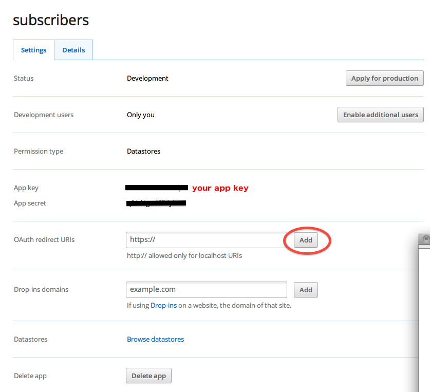

                                                                                                
[Home](http://nigelkelly.github.io)

*4 Oct 2013*
## Limitations of the Dropbox Data Store API 

### What you should be aware of when working with the new Data Store API 

For this tutorial I had actually wanted to develop a simple app which would allow me to collect email addresses of subscribers for my blog. I quickly concluded this was not very easy to do with the Data Store API, at least not in a transparent way. At the moment I feel the Data Store API is missing some crucial elements that developers require:

* Dropbox always has been about multi device sync for a single user's files. Dropbox does this better than anyone. The concept has now been expanded from files to databases. Unfortunately it does not work.
* Dropbox has no concept of a central database repository where a developer can drill through all user data that flows through his app or even create reports from that data. This is the normal way most people think of a database and Dropbox does not see databases like the rest of us. When you do the tutorial below you will see that the developer can only see the data associated with his personal Dropbox account. He cannot see data in other user accounts. Each user database is a disconnected silo. 
* Because there is no concept of a central database repository for your app, users cannot communicate via the API like they can with the Firebase or PouchDB APIs. Users exist in isolation and are not aware of each other. So in the task tutorial presented below there would be no simple way to share your tasks with another person on your team.
* Your apps need to approved by Dropbox. This is red tape I do not need.
* You need to run a local web server. With Firebase you can open index.hmtl from the file system directly and it just starts syncing. One less moving part if you just want to do a quick demo.
* These weaknesses of course have a flip side. Users of the app can be safe in the knowledge that developers cannot easily look at their data. For example if I was to build a multi user task manager in Firebase I could see every user task very easily. With this Dropbox API developers cannot do this easily. 

### The Tutorial - A very simple task manager

The tutorial is very heavily based on the existing Dropbox javascript tutorial. This tutorial you are reading is useful because it clearly spells out how to get things working. The Dropbox tutorial leaves a bit of guesswork for dummies like me to work out. So you may find this tutorial a bit easier.

You need a Dropbox App key to use the Datastore API. So the first thing to do is to register yourself up as a Dropbox developer at https://www.dropbox.com/developers and then setup a new app.


Then click App Console and Create App. You will now see the following screen. Config as shown in the picture below. I called my app "subscribers". Call it whatever you prefer.


The app will be now set up on the Dropbox side and you will be able to get your app key. 



There is only one final awkward task left. You need to enter in OAuth redirect URIs. This sounds a little cryptic but just means your website url address must be listed here so Dropbox knows your site. I developed this app using Google App Engine for my local web server. So my local web server was http://127.0.0.1:11080/ . This will vary on the local web server you are using. Note the ending slash **/** is required. See diagram below. It took me a while to work out why Dropbox did not recognize http://127.0.0.1:11080 . This was very annoying and a bit too exacting for my tastes. We are scripting after all!


You are now good to go.

To make things as simple and universal as possible I decided to just build the Read and Create user functionality. User Deletion and Updating of tasks is not covered here but is trivial to add if you want to go on.

Also I do not use a MV* like knockout, angularjs, emberjs, etc. I just use good old fashioned jquery. If I use a MV* then someone gets alienated. Everyone understands jquery. 

In the head of index.html we will include the Data Store API, jquery and twitter bootstrap. The body contains two basic sections. One to login with dropbox and the other section renders the app. The login section will hide itself when the app section displays.


```html
<head>
	<script src="https://www.dropbox.com/static/api/dropbox-datastores-1.0-latest.js" type="text/javascript"></script>
	<script src="//ajax.googleapis.com/ajax/libs/jquery/1.10.2/jquery.min.js"></script>
	<script src="app.js" defer="defer"></script>
	<link href="http://netdna.bootstrapcdn.com/bootstrap/3.0.0/css/bootstrap.min.css" rel="stylesheet">
</head>

<body>

	<div id="login" class="btn btn-primary">Login with Dropbox</div>
	
	<div id="app" class="well">
		<ul id="todos" class="list-group">
	
		</ul>
	
	
		<input id="newTask" placeholder="Add Task"></input>
	
		<div id="add" class="btn btn-primary">Add Todo</div>	
	</div>
	
</body>
```

And now create a new file called app.js and copy the following code in.


```javascript      
$("#login").show();
$("#app").hide();
// Authenticate with Dropbox
var client = new Dropbox.Client({key: "yourAppKey"});
client.authenticate({interactive: false}, function (error) {
    if (error) {
        alert('Authentication error: ' + error);
    }
});
if (client.isAuthenticated()) {
	$("#login").hide();
	$("#app").show();
}

// Bind authenticate method to your login button and listen for click on button
$("#login").on("click", client.authenticate());


var datastoreManager = client.getDatastoreManager();
datastoreManager.openDefaultDatastore(function (error, datastore) {
    if (error) {
        alert('Error opening default datastore: ' + error);
    }

    // Let the user read all tasks by printing them to the screen
	var taskTable = datastore.getTable('tasks');
	var results = taskTable.query({completed: false});
	
	for (var k=0; k<results.length;k++ ) {
		$("#todos").append( "<li>"+results[k].get("taskname") + "</li>");
	}
	$("li").addClass("list-group-item");
	
	
	// Let users add tasks
	$("#add").on("click", function() {
		taskTable.insert({
		    taskname: $("#newTask").val(),
		    completed: false,
		    created: new Date()
		});
		
	});
	
	// As new tasks are added automatically update the task list
	datastore.recordsChanged.addListener(function (event) {
		var records = event.affectedRecordsForTable('tasks');
		for (var k=0; k<records.length;k++ ) {
			$("#todos").append( "<li>"+records[k].get("taskname") + "</li>");
		}
		$("li").addClass("list-group-item");	
	});		
});
```  
To get this to work you will need to set up a local web server. One option is google app engine. [Here](http://xmodulo.com/2013/02/how-to-make-static-web-site-for-free-via-google-app-engine.html) is a good tutorial about setting up google app engine to be a static page web server.

                                       
And that is it. Everything should work. Go ahead and add tasks.

### More detail about what is happening

Basically a table called tasks has been created in the Data Store. Each record of the tasks table is a task. The fields of the table are **taskname**, **completed**, **created**. If you are a new user a blank table is created and will sync quietly with Dropbox in the background as you add new tasks. If you are an existing user the existing table of tasks will be downloaded from Dropbox.

The code block at the end is a callback that listens for records that change. So every time you create a new record it gets rendered to your task list on screen as well as being synced back to your Dropbox.

Hopefully you find this useful.


###**Comment on [Reddit](http://www.reddit.com/r/javascript/) or [Hacker News](https://news.ycombinator.com/)**