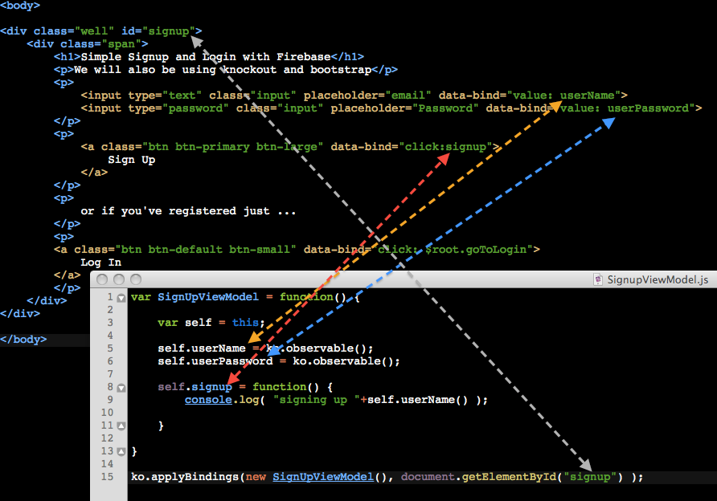
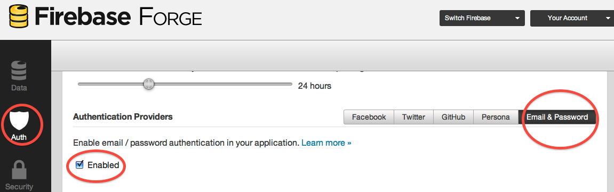
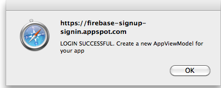

                                                                                                
[Home](http://nigelkelly.github.io)

*19 Sept 2013*
## Firebase signup and login tutorial

In this tutorial you will learn how to set up an effective registration and authentication process for your web app using Firebase, knockoutjs and Twitter Bootstrap.... and..... that's it. No backend mysql database, apache web server, ubuntu linux or ruby scripting is required. You just need to know javascript. You don't even need to know nodejs, npm or requirejs. There really is no back end and it is simple to build.

Here is a working demo of the what you will develop with full authentication working on Google App Engine:

###[Working DEMO of Firebase sign-up and sign-in authentication. Check it out!](https://firebase-signup-signin.appspot.com/)

### Setting up index.html

We will get the javascript libraries we need using script tags. I find requirejs is too complex for my needs. So I will set up the javascript and css through my head tags.

*index.html*

```html

<head>

	<script type='text/javascript'
			src="http://ajax.aspnetcdn.com/ajax/knockout/knockout-2.2.1.js">
	</script>
	<script type='text/javascript'
			src='https://cdn.firebase.com/v0/firebase.js'>
	</script>
	<script type='text/javascript'
			src='https://cdn.firebase.com/v0/firebase-simple-login.js'>
	</script>
	<script type='text/javascript'
			src="js/SignUpViewModel.js"
			defer="defer">
	</script>

	<link href="//netdna.bootstrapcdn.com/bootstrap/3.0.0/css/bootstrap.min.css" rel="stylesheet">

</head>

```

What are these scripts for?

* Knockout - so I can bind my application memory to my html view in an organised and simple way
* Firebase - so I can access a database in the cloud that talks easily with my javascript
* Firebase-simple-login - so I can setup user signup and login really easily
* My own view models - the ko wiring from js to the html views

And then throw in bootstrap so it will look presentable.

### The View

Knockout uses a MVVM (Model-View-ViewModel) pattern. We are starting with the view which is the body of the index.html file. This is quite straight forward. 
Twitter Bootstrap is called in through the class attribute of our input and div tags to make our page look nice. Knockout is called in through the data-bind attribute of our input tags and buttons. When the user keys in her user name and password, we want this data to go into application memory (the Model of MVC) and then on to the Firebase servers. Our View gives is the basic entry points that are required.

Here is how the body will look.

*index.html*

```html

<body>

<div class="well" id="signup">
	<div class="span">
		<h1>Simple Signup and Login with Firebase</h1>
		<p>We will also be using knockout and bootstrap</p>
		<p>
			<input type="text" class="input" placeholder="email" data-bind="value: userName">
			<input type="password" class="input" placeholder="Password" data-bind="value: userPassword">
		</p>
		<p>	
			<a class="btn btn-primary btn-large" data-bind="click:signup">
				Sign Up
			</a>
		</p>
		<p>
			or if you've registered just ...
		</p>
		<p>
		<a class="btn btn-default btn-small" data-bind="click: $root.goToLogin">
			Log In
		</a>
		</p>
	</div>
</div>

</body>

```
	
If you open index.html with the above code you will see a basic sign-up page. 	

### The View Model

The View Model is the magic wiring between the View and application memory. We need to wire 3 things to start with:

* The user name
* The user password
* The sign up button that will submit this data to firebase

Create a new file called SignUpViewModel.js and copy the following code into it.

*SignUpViewModel.js*

```javascript
	
var SignUpViewModel = function() {

	var self = this;

	self.userName = ko.observable();
	self.userPassword = ko.observable();

	self.signup = function() {
		console.log( "signing up "+self.userName() );
		// alert( "signing up "+self.userName() );
	}

}

ko.applyBindings( new SignUpViewModel() );

```
	
Now fire up index.html in your browser. Fill out your user name and click sign-up. Nothing will happen other than the user-name getting logged to the console log. This verifies knockoutjs is working. We still need to implement firebase authentication.

As you can see our initial code is very simple. We make the userName and userPassword variables special knockoutjs observable type objects. This means the data for these variables in the view and in application memory is in sync. The developer does not need to worry about transferring data in the view to memory and vice versa. Here is index.html (the View) and SignUpViewModel.js (the View Model) side by side wired together with knockout.	


	
### Firebase Signup Authentication

To use firebase you will need to setup an account and create a new firebase at [http://firebase.com](http://firebase.com). Or you can use the one provided in the tutorial.

If you are setting up your own firebase then authentication has to be configured. Click on the Auth icon in the Firebase side bar and then select Email & Password Authentication providers. Finally click enabled.



In our code we need a reference to the root of our firebase and to the FirebaseSimpleLogin object which is specifically for email and password authentication to firebase. Add the following to the top of SignUpViewModel.js

*SignUpViewModel.js*

```javascript 

var SignUpViewModel = function() {

	var firebaseRoot = new Firebase("https://your-app.firebaseio.com");

	var authClient = new FirebaseSimpleLogin(firebaseRoot, function(error, user) {
	 	// do login authentication checks
	});
	
	.
	.
	.

}

```

We will add the login checks later but for now we are only doing sign up. Add the following code to the signup function.

*SignUpViewModel.js*

```javascript 

self.signup = function() {
	
	.
	.
	.
	
	console.log( "signing up "+self.userName() );

	authClient.createUser(self.userName(), self.userPassword(), function(error, user) {
	 	// do signup authentication checks here
		if (!error) {
			// User not signed up so .... sign her up
			console.log( "Signed up "+self.userName() );
	    	console.log('Firebase User Id: ' + user.id + ', and Email: ' + user.email);
			alert(user.email + " has successfully signed up. Please login.");
	  	} else {
			// User already signed up
			alert( error.message +" Please login. Thank you.");
		}
	});

}

```

You can now test this and you should see that new users are added easily. If you try to sign up an existing user then you will be politely told to login.

You can download a full working example of the code we have written so far here.

###[Download Firebase Sign-Up Working Example Code](https://github.com/nigelkelly/firebase-signup-signin/tree/88eb9baec9051f45d24f480f5a51f7322a93a821)###

### Working with multiple ViewModels in Knockout

We only have developed the **sign-up** View and View Model so far. We now need to develop the **login** View and View Model. Also we want to be able to dismiss and request our Views as the user requires them. To do this we need to put in place a mechanism that will allow us to talk to both views at the same time so we can tell one to disappear and the other to display as required. We will create a new file called ViewModels.js

*ViewModels.js*

```javascript 

var ViewModels = {
    signupVM : new SignUpViewModel(true),
    loginVM : new LoginViewModel(false)

}

ko.applyBindings(ViewModels);
	
```

Remember to add this file to the head in your index.html It will be the last file after SignUpViewModel.js Whilst you are here, you may as well create a new javascript file called LoginViewModel.js and add it your head tags before ViewModels.js.

*index.html*

```html

<head>

	<script type='text/javascript'
			src="http://ajax.aspnetcdn.com/ajax/knockout/knockout-2.2.1.js">
	</script>
	<script type='text/javascript'
			src='https://cdn.firebase.com/v0/firebase.js'>
	</script>
	<script type='text/javascript'
			src='https://cdn.firebase.com/v0/firebase-simple-login.js'>
	</script>
	<script type='text/javascript'
			src="js/SignUpViewModel.js"
			defer="defer">
	</script>
	<script type='text/javascript'
			src="js/LoginViewModel.js"
			defer="defer">
	</script>
	<script type='text/javascript'
			src="js/ViewModels.js"
			defer="defer">
	</script>
	
	<link href="//netdna.bootstrapcdn.com/bootstrap/3.0.0/css/bootstrap.min.css" rel="stylesheet">

</head>

```

ko.applyBindings is called on both view models on initialization so that all our wiring is in place. 

**Remember: Remove the ko.applyBindings call in SignUpViewModel.js.** 

We now need to edit the body of index.html (our Views) as follows:

```html

<body>

	<div id="signup" class="well" data-bind="visible: signupVM.isVisible">
		<div  class="span">
		    <h1>Simple Signup and Login with Firebase</h1>
		    <p>We will also be using knockout and bootstrap</p>
		    <p>
		    	<input type="text" class="input" placeholder="email" data-bind="value: signupVM.userName">
		  		<input type="password" class="input" placeholder="Password" data-bind="value: signupVM.userPassword">
		    </p>
		    <p>	
			    <a class="btn btn-primary btn-large" data-bind="click:signupVM.signup">
					Sign Up
			    </a>
			</p>
			<p>
			or if you've registered just ...
			</p>
			<p>
			    <a class="btn btn-default btn-small" data-bind="click: loginVM.makeVisible">
					Log In
			    </a>
		    </p>
	    </div>
	</div>

	<div id="login" class="well" data-bind="visible: loginVM.isVisible">
		<div class="span">
		  	<h1>Simple Signup and Login with Firebase<</h1>
		    <p>We will also be using knockout and bootstrap</p>
		    <p>
		    	<input type="text" class="input" placeholder="Email" data-bind="value: loginVM.userName">
		  			<input type="password" class="input" placeholder="Password" data-bind="value: loginVM.userPassword">
		    </p>
		    <p>	
			    <a class="btn btn-primary btn-large" data-bind="click:loginVM.login">
					Log In
			    </a>
			</p>
		</div>
	</div>


</body>
	
```

The main thing to note is how we make explicit references to each Viem Model in the html. For example, on clicking the signup button we explicitly call signupVM.signup instead of just signup. We need to specify the View Model so we can access its particular functions and properties. The important thing is that we can now make a call to the login View Model from the signup View. **See how the function loginVM.makeVisible is called when we click the login button in the sign-up view.** 

Another point to note is that we are making use of a new knockout piece of wiring called visible. 

```html


	<div id="login" class="well" data-bind="visible: loginVM.isVisible">

```

	
If the function loginVM.isVisible returns true then the the login view will render itself visible to the user. If it is false then this view will be dismissed from the screen.

### Creating a Login Authentication Module

Now add the following code to LoginViewModel.js

*LoginViewModel.js*

```javascript 

var LoginViewModel = function(makeLoginViewVisible) {
		
	var firebaseRoot = new Firebase("https://flat-tasks.firebaseio.com"); 
	
	// Create an authcient object when we fire-up the app
	var authClient = new FirebaseSimpleLogin(firebaseRoot, function(error, user) {
		
		//Here is some login authentication handling
	 	if (error) {
	    	// an error occurred while attempting login
	    	console.log(error);
			alert("User name or password is not correct. Please try again.");
			
			// Make the login view visible again
			self.isVisible(true);
	  	} else if (user) {
	    	// user authenticated with Firebase
	    	console.log('Logging In User ID: ' + user.id + ', Provider: ' + user.provider);  
	    	alert("LOGIN SUCCESSFUL. Create a new AppViewModel for your app")
	  	} else {
	    	// user is logged out
			console.log("User logged out");
	  	}
	
	});
	
	var self = this;
	
	self.userName = ko.observable("");      
	self.userPassword = ko.observable(""); 
	self.isVisible = ko.observable(makeLoginViewVisible); 
	
	self.makeVisible = function() {
		self.isVisible(true);
		
		// Note that we can make a call to the signupVM from the loginVM
		ViewModels.signupVM.isVisible(false);
	}
	
	self.login = function() {
		console.log("logging in");
		self.isVisible(false);
		
		// authClient is invoked here when the user clicks login
		authClient.login('password', {
			email: self.userName(),
		  	password: self.userPassword()
	  	});     
	}

}


```

The code for LoginViewModel.js is very similar to SignUpViewModel.js The main difference is the way we use authClient. When we first create authClient we supply it with a callback function that will handle our login request. For signing up our callback function was blank. Also when the user clicks the login button a call is made to authClient.login(...) as opposed to authClient.createUser(...) that fires on clicking the sign-up button. 	

Another key point is to do with multiple view models. Communications between view models is not just limited to HTML we can also make calls between view models in javascript. Look at the code for self.makeVisible()

*LoginViewModel.js*

```javascript

	self.makeVisible = function() {
		self.isVisible(true);
		ViewModels.signupVM.isVisible(false);
	}

```

Now we you go to click login you will have successfully logged in if you get the following alert:

*LOGIN SUCCESSFUL. Create a new AppViewModel for your app*



**You have now been full authenticated to proceed into our app!!**

Full code for Sign-up and Sign-in authentication can be downloaded here:

###[Download Firebase Sign-Up and Sign-In Working Example Code](https://github.com/nigelkelly/firebase-signup-signin)###

 
###Conclusion

Well now it is time for you to create a new killer app or maybe a hosted task list for you and your team. The next step would be to go to ViewModels.js and add in AppViewModel.js

*ViewModels.js*

```javascript 

var ViewModels = {
    signupVM : new SignUpViewModel(true),
    loginVM : new LoginViewModel(false),
	appVM: new AppViewModel(false)
	//add other new VMs here
   
}

ko.applyBindings(ViewModels);

```

Get hacking on AppViewModel.js

The World is your oyster.

###**Comment on [Reddit](http://www.reddit.com/r/javascript/comments/1lsb5q/the_dark_side_of_firebase_syncing_test_procedure/) or [Hacker News](https://news.ycombinator.com/item?id=6334385)**