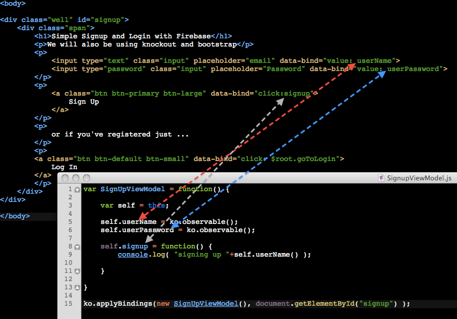
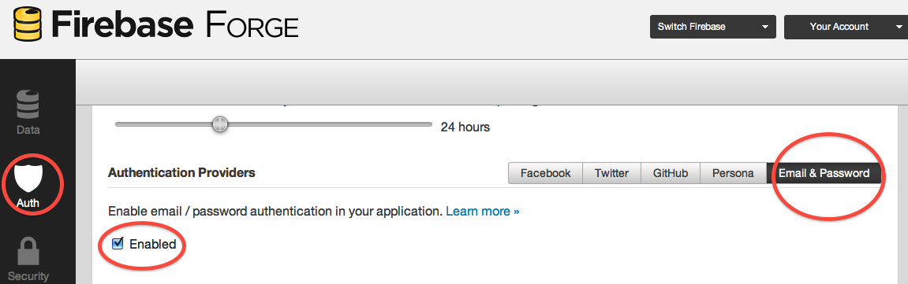

                                                                                                
[Home](http://nigelkelly.github.io)

*19 Sept 2013*
## Firebase signup and login tutorial

In this tutorial you will learn how to set up an effective registration and authentication process for your web app using Firebase, Knockout and Twitter Bootstrap.... and..... that's it. No backend mysql database, apache web server, ubuntu linux or ruby scripting is required. You just need to know javascript. 
You don't even need to know node. We will be using normal javascript. No npm or requirejs is required;) It is a nobackend app.	

### Setting up index.html

We will get the javascript libraries we need using script tags. I find requirejs is too complex for my needs. So I will set up the javascript and css through my head tags.

So here are the scripts we need:
* Knockout - so I can bind my application memory to my html view in an organised and simple way
* Firebase - so I can access a database in the cloud that talks easily with my javascript
* FirebaseAuth - so I can setup user signup and login really easily
* My own view models - the ko wiring from js to the html views

And then throw in bootstrap so it will look presentable.

Here is how the head in index.hmtl looks.

```html

<head>

	<script type='text/javascript'
			src="http://ajax.aspnetcdn.com/ajax/knockout/knockout-2.2.1.js">
	</script>
	<script type='text/javascript'
			src='https://cdn.firebase.com/v0/firebase.js'>
	</script>
	<script type='text/javascript'
			src='https://cdn.firebase.com/v0/firebase-simple-login.js'>
	</script>
	<script type='text/javascript'
			src="js/SignUpViewModel.js"
			defer="defer">
	</script>

	<link href="//netdna.bootstrapcdn.com/bootstrap/3.0.0/css/bootstrap.min.css" rel="stylesheet">

</head>

```

### The View

Knockout uses a MVVM (Model-View-ViewModel) pattern. We are starting with the view which is the body of the index.html file. This is quite straight forward. 
Twitter Bootstrap is called in through the class attribute of our input and div tags to make our page look nice. Knockout is called in through the data-bind attribute of our input tags and buttons. When the user keys in her user name and password, we want this data to go into application memory (the Model of MVC) and then on to the Firebase servers. Our View gives is the basic entry points that are required.

Here is how the body will look.


```html

<body>

<div class="well" id="signup">
	<div class="span">
		<h1>Simple Signup and Login with Firebase</h1>
		<p>We will also be using knockout and bootstrap</p>
		<p>
			<input type="text" class="input" placeholder="email" data-bind="value: userName">
			<input type="password" class="input" placeholder="Password" data-bind="value: userPassword">
		</p>
		<p>	
			<a class="btn btn-primary btn-large" data-bind="click:signup">
				Sign Up
			</a>
		</p>
		<p>
			or if you've registered just ...
		</p>
		<p>
		<a class="btn btn-default btn-small" data-bind="click: $root.goToLogin">
			Log In
		</a>
		</p>
	</div>
</div>

</body>

```
	
If you open index.html you will see a basic sign-up page. 	

### The ViewModel

The ViewModel is the magic wiring between the View and application memory. We need to wire 3 things to start with:
* The user name
* The user password
* The sign up button that will submit this data to firebase

Create a new file called SignUpViewModel.js and copy the following code into it.

```javascript
	
var SignUpViewModel = function() {

	var self = this;

	self.userName = ko.observable();
	self.userPassword = ko.observable();

	self.signup = function() {
		console.log( "signing up "+self.userName() );

	}

}

ko.applyBindings(new SignUpViewModel(), document.getElementById("signup") );

```
	
Now fire up index.html in your browser. Fill out your user name and click sign-up. Nothing will happen other than the user-name getting logged to the console. This verifies knockout is working. We still need to implement firebase authentication.

As you can see our initial code is very simple. We make the userName and userPassword variables special knockout observable type objects. This means the data for these variables in the view and in application memory is in sync. The developer does not need to worry about transferring data in the view to memory and vice versa. Here is index.html (the View) and SignViewModel.js (the ViewModel) side by side wired together with knockout.	


	
### Firebase Signup Authentication

To use firebase you will need to setup an account and create a new firebase. Or you can use the one provided in the tutorial.

If you are setting up your own firebase then authentication has to be configured. Click on the Auth icon in the Firebase side bar and then select Email & Password Authentication providers. Finally click enabled.



In our code we need a reference to the root of our firebase and to the FirebaseSimpleLogin object which is specifically for email and password
authentication to firebase. 

```javascript 

var SignUpViewModel = function() {

	var firebaseRoot = new Firebase("https://your-app.firebaseio.com");

	var authClient = new FirebaseSimpleLogin(firebaseRoot, function(error, user) {
	 	// do login authentication checks
	});
	
	.
	.
	.

}

```

We will add the login checks later but for now we are only doing sign up. Add the following code to the signup function.

```javascript 

self.signup = function() {
	
	.
	.
	.
	
	console.log( "signing up "+self.userName() );

	authClient.createUser(self.userName(), self.userPassword(), function(error, user) {
	 	// do signup authentication checks here
		if (!error) {
			// User not signed up so .... sign her up
			console.log( "Signed up "+self.userName() );
	    	console.log('Firebase User Id: ' + user.id + ', and Email: ' + user.email);
			alert("You have been successfull signed up. Please login. Thank you.");
	  	} else {
			// User already signed up
			alert( error.message +" Please login. Thank you.");
		}
	});

}

```

You can now test this and you should see that new users are added easily. If you try to sign up an existing user then you will be politely told to login.

You can download a full working example of the code we have written so far here.

####[Firebase Sign-Up Working Example Code](https://github.com/nigelkelly/firebase-signup-signin/tree/88eb9baec9051f45d24f480f5a51f7322a93a821)####

### Working with multiple ViewModels in Knockout

We only have developed the **sign-up** View and ViewModel so far. We now need to develop the **login** View and ViewModel. Also we want to be able to dismiss and request our Views as the user requires them. To do this we need to put in place a mechanism that will allow us to talk to both views at the same time so we can tell one to disappear and the other to display as required. We will create a new file called ViewModels.js


*ViewModels.js*

```javascript 

var ViewModels = {
    signupVM : new SignUpViewModel(true),
    loginVM : new LoginViewModel(false)

}

ko.applyBindings(ViewModels);
	
```

Remember to add this file to the head in your index.html It will be the last file after SignUpViewModel.js  
Whilst you are here, you may as well create a new javascript file called LoginViewModel.js
ko.applyBindings is called on both view models on initialization so that all our wiring is in place. 
*Remember: Remove the ko.applyBindings call in SignUpViewModel.js.* 

We now need to edit index.html as follows:

```html

<body>

	<div id="signup" class="well" data-bind="visible: signupVM.isVisible">
		<div  class="span">
		    <h1>Simple Signup and Login with Firebase</h1>
		    <p>We will also be using knockout and bootstrap</p>
		    <p>
		    	<input type="text" class="input" placeholder="email" data-bind="value: signupVM.userName">
		  		<input type="password" class="input" placeholder="Password" data-bind="value: signupVM.userPassword">
		    </p>
		    <p>	
			    <a class="btn btn-primary btn-large" data-bind="click:signupVM.signup">
					Sign Up
			    </a>
			</p>
			<p>
			or if you've registered just ...
			</p>
			<p>
			    <a class="btn btn-default btn-small" data-bind="click: loginVM.makeVisible">
					Log In
			    </a>
		    </p>
	    </div>
	</div>

	<div id="login" class="well" data-bind="visible: loginVM.isVisible">
		<div class="span">
		  	<h1>Simple Signup and Login with Firebase<</h1>
		    <p>We will also be using knockout and bootstrap</p>
		    <p>
		    	<input type="text" class="input" placeholder="Email" data-bind="value: loginVM.userName">
		  			<input type="password" class="input" placeholder="Password" data-bind="value: loginVM.userPassword">
		    </p>
		    <p>	
			    <a class="btn btn-primary btn-large" data-bind="click:loginVM.login">
					Log In
			    </a>
			</p>
		</div>
	</div>


</body>
	
```

The main thing to note is how we make explicit references to each ViemModel in the html. For example, on clicking the signup button we explicitly call signupVM.signup instead of just signup. We need to specify the ViewModel so we can access its particular functions and properties. The important thing is that we can now make a call to the login ViewModel from the signup View. **See how the function loginVM.makeVisible is called when we click the login button in the sign-up view.** 

The other important point is that we are making use of a new knockout piece of wiring called visible. 

```html


	<div id="login" class="well" data-bind="visible: loginVM.isVisible">

```

	
If the function loginVM.isVisible returns true then the the login view will render itself visible to the user. If it is false then this view will be dismissed from the screen.

### Creating an Authentication Module

Now add the following code to LoginViewModel.js

```javascript 

var LoginViewModel = function(makeLoginViewVisible) {
		
	var firebaseRoot = new Firebase("https://flat-tasks.firebaseio.com"); 
	
	var authClient = new FirebaseSimpleLogin(firebaseRoot, function(error, user) {
		
		//Here is some login authentication handling
	 	if (error) {
	    	// an error occurred while attempting login
	    	console.log(error);
			alert("User name or password is not correct. Please try again.");
	  	} else if (user) {
	    	// user authenticated with Firebase
	    	console.log('Logging In User ID: ' + user.id + ', Provider: ' + user.provider);  
	    	alert("Create a new AppViewModel for your app")
	  	} else {
	    	// user is logged out
			console.log("User logged out");
	  	}
	
	});
	
	var self = this;
	
	self.userName = ko.observable("");      
	self.userPassword = ko.observable(""); 
	self.isVisible = ko.observable(makeLoginViewVisible); 
	
	self.makeVisible = function() {
		self.isVisible(true);
		ViewModels.signupVM.isVisible(false);
	}
	
	self.login = function() {
		console.log("logging in");
		self.isVisible(false);
		authClient.login('password', {
			email: self.userName(),
		  	password: self.userPassword()
	  	});     
	}

}


```
	

Now we you go to login you will get an alert box saying *Create a new AppViewModel for your app*. Well now it is time for you to create a new killer app or maybe a hosted task list for you and your team. The next step is to go to ViewModels.js and add in AppViewModel.js

```javascript 

var ViewModels = {
    signupVM : new SignUpViewModel(true),
    loginVM : new LoginViewModel(false),
	appVM: new AppViewModel(false)
   
}

ko.applyBindings(ViewModels);

```

Now get hacking on AppViewModel.js

The World is your oyster.

###**Comment on [Reddit](http://www.reddit.com/r/javascript/comments/1lsb5q/the_dark_side_of_firebase_syncing_test_procedure/) or [Hacker News](https://news.ycombinator.com/item?id=6334385)**